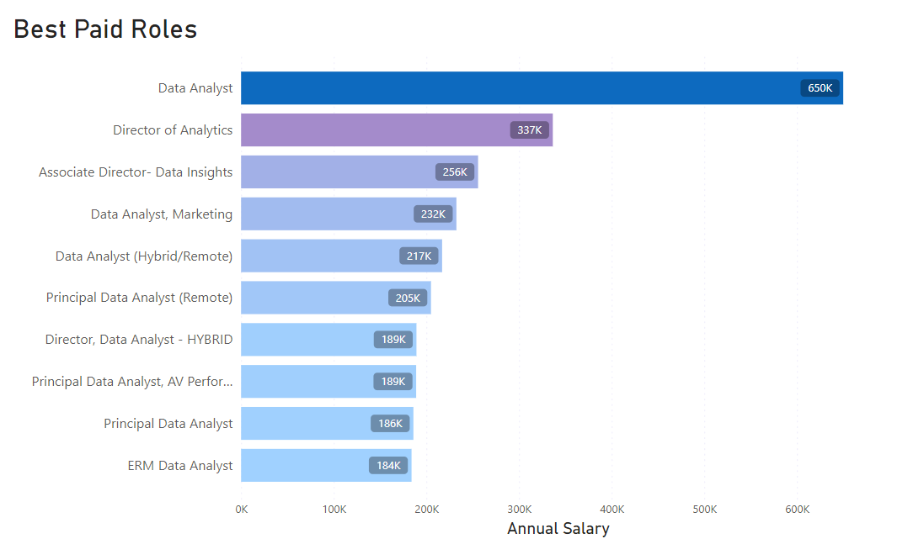
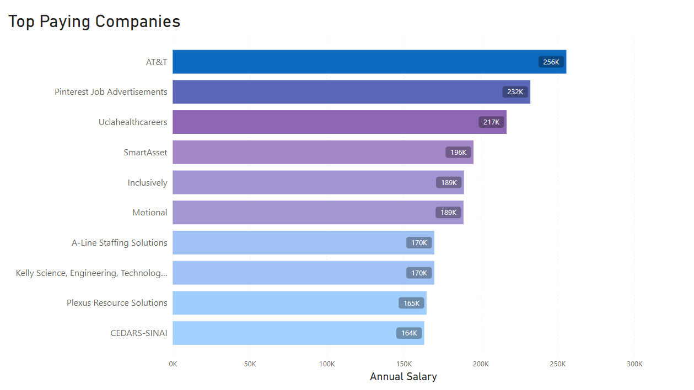
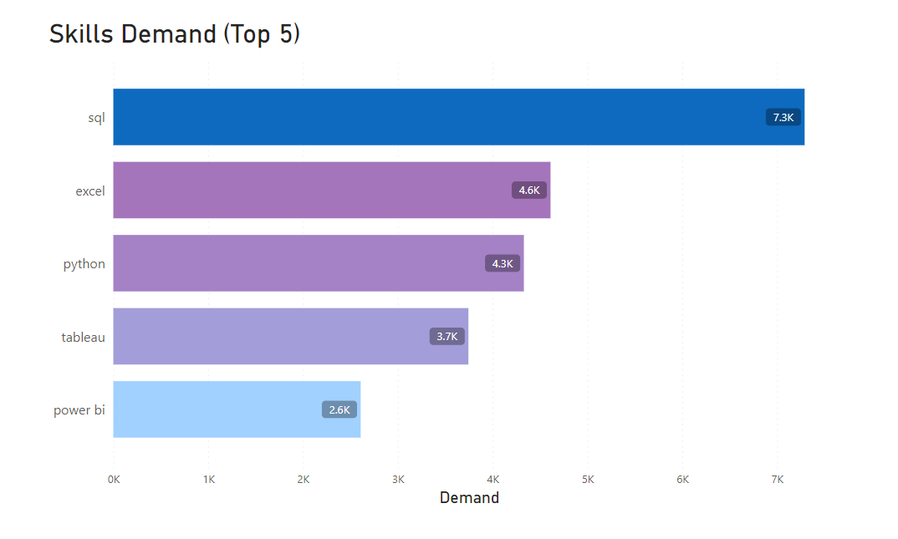
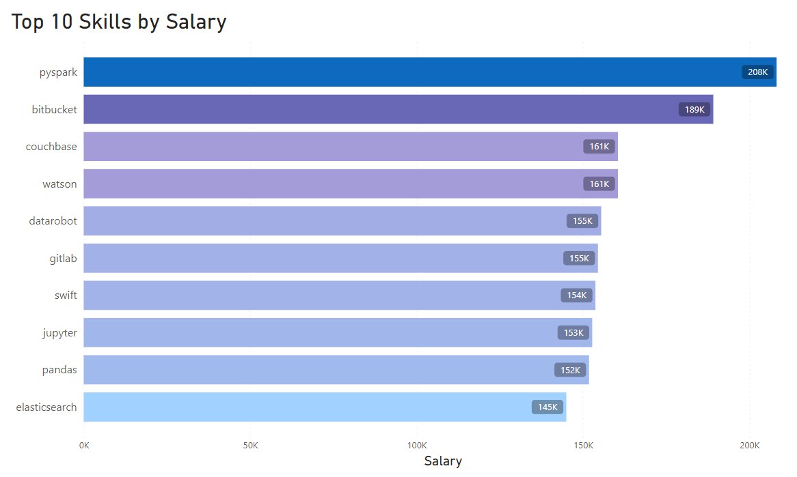
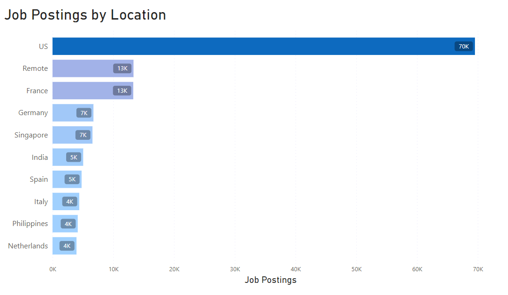
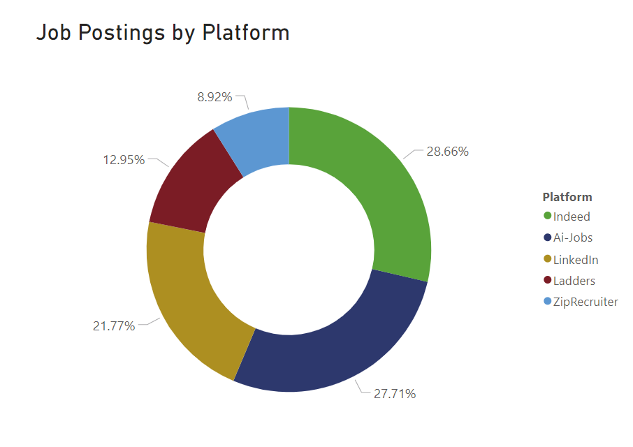
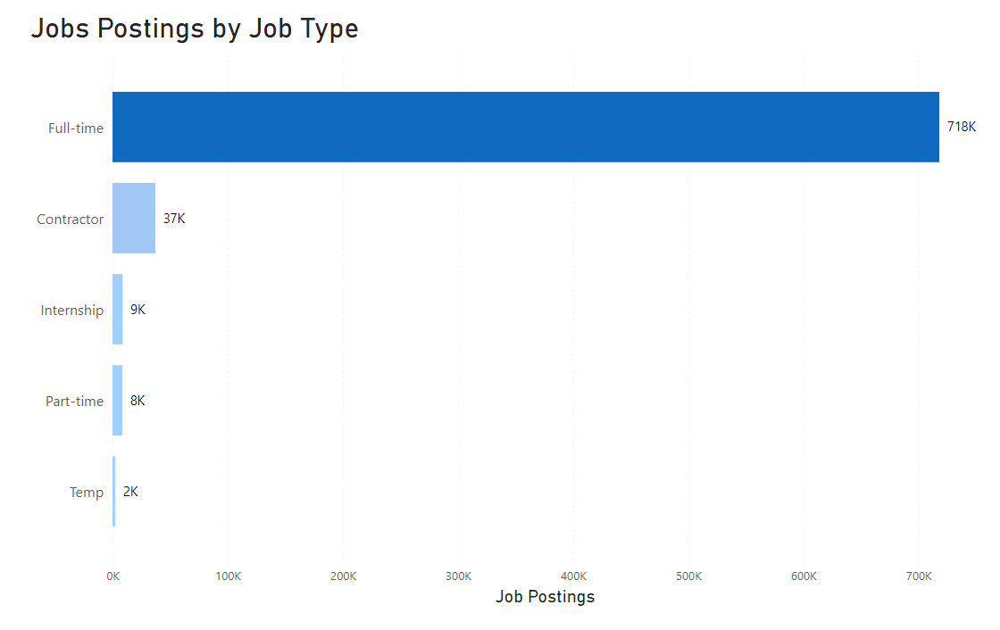

# Introduction
In this project, I explore top-paying jobs, in-demand skills, and high salaries jobs in data analytics.

SQL queries? Check them out here: [project_sql folder](/project_sql/)

# Background
This analysis intends to explore the available data on data roles job market.
In this project I will unearth insights into highly paid jobs, skills, and job postings, to enable job seekers to find optimal jobs.
Furthermore, the insights will also help prospective data nerds to develop or improve their skills as per the requirements of the job market.

Data can be downloaded from here:  [Data](https://1x1kjh-my.sharepoint.com/:f:/g/personal/kenpeter_1x1kjh_onmicrosoft_com/El8IOEmbvuJOjNlHCj2jAe0B4IvqKvPyj52v6mWw7ctIkQ?e=aXy4TG). It contains information on data roles, salaries, locations, and other related information.

### The questions I wanted to answer through my SQL queries were:

1. What are the top 10 best-paid remote data analyst jobs?
2. What are the top 10 best-paying companies for remote data analyst jobs? 
3. What are the top 5 in-demand skills for remote data analyst jobs?
4. What are the best-paid skills for data analysts?
5. What are the most optimal skills to learn (skills that have the highest demand and 
  are the highest-paying)?
6. Which countries have the highest number of job postings of Data Analysts?
7. What are the top job portals in terms of number of job listings?
8. What is the breakdown of job postings by job type?

# Tools Used
To analyze the data and to answer the above-mentioned questions I used the following tools:

- **SQL:** It allowed and facilitated creating and then querying the database to gain insights into the data.
- **PostgreSQL:** This database management system, was chosen for handling exploring, and analyzing the data.
- **Microsoft Power BI:** For visualizing the output of the SQL queries.
- **Visual Studio Code:** For executing SQL queries.

# Analysis
The database was created and analyzed to investigate different aspects of the data to answer the above-mentioned questions.:

### 1. Best-paid remote data analyst jobs
To identify the best-paid remote data analyst jobs, I filtered data analyst postings by average yearly salary and location, focusing on remote jobs. The output of the query highlights the best-paid remote data analyst postings.

```sql
SELECT  
    job_title,
    salary_year_avg
FROM
    job_postings_fact
WHERE
    job_title_short = 'Data Analyst' AND 
    job_location = 'Anywhere' AND 
    salary_year_avg IS NOT NULL
ORDER BY
    salary_year_avg DESC
LIMIT 10;
```

- **Query Result**

    | job_title                                         | salary_year_avg   |
    |---------------------------------------------------|-------------------|
    | Data Analyst                                      | 650000.0          |
    | Director of Analytics                             | 336500.0          |
    | Associate Director- Data Insights                 | 255829.5          |
    | Data Analyst, Marketing                           | 232423.0          |
    | Data Analyst (Hybrid/Remote)                      | 217000.0          |
    | Principal Data Analyst (Remote)                   | 205000.0          |
    | Director, Data Analyst - HYBRID                   | 189309.0          |
    | Principal Data Analyst, AV Performance Analysis   | 189000.0          |
    | Principal Data Analyst                            | 186000.0          |
    | ERM Data Analyst                                  | 184000.0          |


**Insights:**
- **Salary Range:** The salary ranges from $184,000 to $650,000, indicating significant variation.
- **Diverse Employers:** Companies like SmartAsset, Meta, and AT&T are among those offering high salaries.
- **Job Title Variety:** There's a high diversity in job titles, from Data Analyst to Director of Analytics, reflecting varied roles and specializations within data analytics.


*The bar chart visualizes the salary of the 10 best-paid remote data analyst job postings.*

### 2. Best Paying Companies
To gain an insight into the salary paid by companies, I used common table expressions (CTE) and JOIN statements to gain insights into the top 10 companies that offer the highest average annual salary to remote data analysts.

```sql
WITH top_paying_jobs AS (
    SELECT  
        job_id,
        salary_year_avg,
        name AS company_name
    FROM
        job_postings_fact
    LEFT JOIN company_dim ON job_postings_fact.company_id = company_dim.company_id
    WHERE
        job_title_short = 'Data Analyst' AND 
        job_location = 'Anywhere' AND 
        salary_year_avg IS NOT NULL
    ORDER BY
        salary_year_avg DESC
)

SELECT 
    company_name,
    ROUND(avg(salary_year_avg), 0) AS avg_salary
    --skills
FROM top_paying_jobs
INNER JOIN skills_job_dim ON top_paying_jobs.job_id = skills_job_dim.job_id
INNER JOIN skills_dim ON skills_job_dim.skill_id = skills_dim.skill_id
GROUP BY 
  company_name
ORDER BY
    avg_salary DESC
LIMIT 10;
```
- **Query Result**

    | company_name                                      | avg_salary    |
    |---------------------------------------------------|---------------|
    | AT&T                                              |  255830       |
    | Pinterest Job Advertisements                      |  232423       |
    | Uclahealthcareers                                 |  217000       |
    | SmartAsset                                        |  195500       |
    |  Inclusively                                      |  189309       |
    | Motional                                          |  189000       |
    | A-Line Staffing Solutions                         |  170000       |
    | Kelly Science, Engineering, Technology & Telecom  |  170000       |
    | Plexus Resource Solutions                         |  165000       |
    | CEDARS-SINAIPlexus Resource Solutions             |  163500       |


    *Top 10 Best Paying Companies*


The output of the query provides the following insights:

- **Top-paying Companies:**
AT&T has the highest average salary at $255,830.
Pinterest Job Advertisements follow closely with an average salary of $232,423.
UCLA Health Careers ranks third with an average salary of $217,000.
- **Range of Salaries:**
Salaries range from $163,500 at Cedars-Sinai to $255,830 at AT&T, indicating a significant variance in salary.
- **Industry Representation:**
The list includes companies from various sectors such as telecommunications (AT&T), technology (Pinterest, SmartAsset), healthcare (UCLA Health, Cedars-Sinai), staffing solutions (A-Line Staffing, Plexus Resource), and more.




### 3. Top Demanded Skills for Data Analysts

The objective is to query the data to gain insights that can help individuals prioritize their skill development efforts based on the current demand in the job market. 

```sql
SELECT 
    skills,
    COUNT(skills_job_dim.job_id) AS demand_count
FROM job_postings_fact
INNER JOIN skills_job_dim ON job_postings_fact.job_id = skills_job_dim.job_id
INNER JOIN skills_dim ON skills_job_dim.skill_id = skills_dim.skill_id
WHERE
    job_title_short = 'Data Analyst' 
    AND job_work_from_home = True 
GROUP BY
    skills
ORDER BY
    demand_count DESC
LIMIT 5;
```
- **Query Result**

    | Skills   | Demand Count |
    |----------|--------------|
    | SQL      | 7291         |
    | Excel    | 4611         |
    | Python   | 4330         |
    | Tableau  | 3745         |
    | Power BI | 2609         |

    *Top 5 in-demand data analyst skills*

The output of the query offers the following insights:

- **SQL:**
SQL is the most in-demand skill. This indicates a strong appetite for skills in database management and data querying, indicating a strong demand for handling and analyzing data stored in relational databases.
- **Excel:**
Excel comes next in demand, with a demand count of 4,611.
This reflects the continued importance of spreadsheet software data analytics.
- **Python:**
Python ranks third in demand, with a demand count of 4,330.
The popularity of Python highlights its versatility and widespread adoption in data analytics.
- **Tableau:**
Tableau follows with a demand count of 3,745.
This shows a strong demand for skills, indicating the importance of presenting data insights for decision-making purposes.
- **Power BI:**
Power BI has a demand count of 2,609, making it the least in demand among the listed skills.
However, it still represents a substantial need for skills in Microsoft's business intelligence and analytics platform, particularly for data visualization and reporting tasks.



### 4. Best Paid Skills
Here I want to query the data to gain insights into the skills and their respective average salaries, providing valuable information for professionals looking to enhance their expertise or make informed decisions about career paths and skill development strategies.

```sql
SELECT 
    skills,
    ROUND(AVG(salary_year_avg), 0) AS avg_salary
FROM job_postings_fact
INNER JOIN skills_job_dim ON job_postings_fact.job_id = skills_job_dim.job_id
INNER JOIN skills_dim ON skills_job_dim.skill_id = skills_dim.skill_id
WHERE
    job_title_short = 'Data Analyst'
    AND salary_year_avg IS NOT NULL
    AND job_work_from_home = True 
GROUP BY
    skills
ORDER BY
    avg_salary DESC
LIMIT 10;
```
- **Query Result**

    | Skills        | Average Salary ($) |
    |---------------|-------------------:|
    | pyspark       |            208,172 |
    | bitbucket     |            189,155 |
    | couchbase     |            160,515 |
    | watson        |            160,515 |
    | datarobot     |            155,486 |
    | gitlab        |            154,500 |
    | swift         |            153,750 |
    | jupyter       |            152,777 |
    | pandas        |            151,821 |
    | elasticsearch |            145,000 |

    
The results of the query offer the following insights:

- **Top-Paying Skills:**
PySpark stands out as the highest-paying skill, with an average salary of $208,172.
This indicates a strong demand for professionals skilled in big data processing and analytics.
- **Skills with Moderate Demand and Decent Salaries:**
Skills like Bitbucket, Couchbase, Watson, DataRobot, and GitLab have average salaries ranging from $154,500 to $189,155.
While these skills may not have the highest average salaries, they still command respectable compensation, indicating moderate demand and specialized expertise in areas such as version control, NoSQL databases, AI platforms, automated machine learning, and source code management.
- **Common Infrastructure and Data Tools:**
Infrastructure and data-related skills like Linux, PostgreSQL, GCP (Google Cloud Platform), and MicroStrategy are also represented in the dataset, with average salaries ranging from $121,619 to $136,508.
These skills are foundational in many industries, highlighting the continued importance of maintaining and analyzing data, managing cloud infrastructure, and leveraging business intelligence tools for decision-making.



### 5. Most Optimal Skills to Learn

Here the objective is to gain insights that can help professionals to prioritize their skill development efforts based on market demand and potential salary outcomes. Additionally, they provide valuable information for employers seeking to recruit talent with specific skill sets.

```sql
SELECT 
    skills_dim.skill_id,
    skills_dim.skills,
    COUNT(skills_job_dim.job_id) AS demand_count,
    ROUND(AVG(job_postings_fact.salary_year_avg), 0) AS avg_salary
FROM job_postings_fact
INNER JOIN skills_job_dim ON job_postings_fact.job_id = skills_job_dim.job_id
INNER JOIN skills_dim ON skills_job_dim.skill_id = skills_dim.skill_id
WHERE
    job_title_short = 'Data Analyst'
    AND salary_year_avg IS NOT NULL
    AND job_work_from_home = True 
GROUP BY
    skills_dim.skill_id
HAVING
    COUNT(skills_job_dim.job_id) > 10
ORDER BY
    avg_salary DESC,
    demand_count DESC
LIMIT 25;

```
- **Query Result**

| Skill ID | Skills     | Demand Count | Average Salary ($) |
|----------|------------|--------------|-------------------:|
| 8        | go         | 27           |            115,320 |
| 234      | confluence | 11           |            114,210 |
| 97       | hadoop     | 22           |            113,193 |
| 80       | snowflake  | 37           |            112,948 |
| 74       | azure      | 34           |            111,225 |
| 77       | bigquery   | 13           |            109,654 |
| 76       | aws        | 32           |            108,317 |
| 4        | java       | 17           |            106,906 |
| 194      | ssis       | 12           |            106,683 |
| 233      | jira       | 20           |            104,918 |

*The most optimal skills for a data analyst (by salary)*

The output of the query provides the following insights:

- **Snowflake and Azure are Highly Demanded with Decent Salaries:**
Snowflake and Azure are the most in-demand skills with demand counts of 37 and 34 respectively.
Despite not having the highest average salaries, they offer decent compensation, with Snowflake at $112,948 and Azure at $111,225 on average.
- **Python and R Dominate Demand with Moderate Salaries:**
Python and R exhibit high demand with demand counts of 236 and 148 respectively.
While their average salaries are not the highest in the dataset, they still offer moderate compensation, with Python at $101,397 and R at $100,499 on average.

- **Tableau Shows High Demand with Competitive Salary:**
Tableau has a significant demand count of 230, indicating a strong need for data visualization skills.
Despite not having the highest average salary, Tableau offers competitive compensation at $99,288 on average.
This highlights the importance of data visualization tools in conveying insights and aiding decision-making processes.

### 6. Top Countries by Job Postings 

Here I want to gain insights into the data to understand the distribution of job opportunities across different countries or regions.

```sql 
SELECT
    CASE
        WHEN LENGTH(TRIM(SPLIT_PART(country, ',', -1))) = 2 THEN 'US'
        WHEN TRIM(SPLIT_PART(country, ',', -1)) = 'Anywhere' THEN 'Remote'
        ELSE TRIM(SPLIT_PART(country, ',', -1))
        END AS location
    ,Count(*) AS job_postings
FROM 
    (SELECT
        job_location,
        job_title_short,
        TRIM(SPLIT_PART(job_location, '(', -1)) AS country
    FROM 
        job_postings_fact
)
WHERE
    job_title_short = 'Data Analyst'
GROUP BY
    location
ORDER BY
    COUNT(*) DESC
LIMIT 10;
```

- **Query Result**

| location     | job_postings   |
|--------------|----------------|
| US           | 69535          |
| Remote       | 13331          |
| France       | 13292          |
| Germany      | 6735           |
| Singapore    | 6578           |
| India        | 5047           |
| Spain        | 4788           |
| Italy        | 4402           |
| Philippines  | 4152           |
| Netherlands  | 3948           |

The result of the query provides the following insights:

- **US Dominates Job Postings:**
The United States (US) leads with the highest number of job postings at 69,535.
This indicates a robust job market in the US, likely driven by its large economy, diverse industries, and technological advancements.
- **Remote Work Opportunities are Significant:**
Remote job is the second-highest category with 13,331 job postings.
This suggests a growing trend towards remote work arrangements, possibly fueled by advancements in communication technology and changing workplace dynamics, especially in response to global events like the COVID-19 pandemic.
- **Strong Job Markets in European Countries:**
France, Germany, and Singapore follow with substantial numbers of job postings (13,292, 6,735, and 6,578 respectively).
This indicates strong job markets in these countries, reflecting their economic stability, skilled workforce, and business opportunities.
- **Asia-Pacific Region Shows Promising Opportunities:**
Singapore, India, and the Philippines represent significant job markets in the Asia-Pacific region, with 6,578, 5,047, and 4,152 job postings respectively.
This highlights the growing importance of the Asia-Pacific region in global business and employment, driven by factors such as economic growth, technological innovation, and globalization.



### 7. Top Job Portals/Platforms 

Here I query the data to gain insights for job seekers and employers, helping them understand the landscape of job boards and where to focus their efforts for job searching or posting vacancies.

```sql
SELECT
    TRIM(SPLIT_PART(TRIM(SPLIT_PART(job_via, ' ', -1)), '.', 1)) as job_board,
    count(*) AS job_postings
FROM 
    job_postings_fact
WHERE
        job_title_short = 'Data Analyst' AND 
        salary_year_avg IS NOT NULL
GROUP BY
    job_board
ORDER BY
    job_postings DESC
LIMIT 5;
```

- **Query Result**

| job_board     | job_postings  |
|---------------|---------------|
| Indeed        |1144           |
| Ai-Jobs       |1106           |
|LinkedIn       |869            |
|Ladders        |517            |
|ZipRecruiter   |356            |

The result of the query provides the following insights:

- **Indeed and Ai-Jobs Lead in Job Postings:**
"Indeed" and "Ai-Jobs" are the top two job boards, with 1,144 and 1,106 postings respectively.
These platforms have the highest number of job postings, indicating their popularity and effectiveness in connecting job seekers with employers.
- **LinkedIn Shows Strong Presence:**
"LinkedIn" follows closely with 869 postings.
LinkedIn is a prominent platform for professional networking and job searching.
- **Ladders Represents a Niche Market:**
"Ladders" has 517 postings.
- **ZipRecruiter Shows Moderate Activity:**
"ZipRecruiter" has 356 postings, representing a moderate level of activity compared to the top four job boards.



### 8. Postings by Job Types 

Next, I want to highlight the type of job opportunities available, to cater to the preferences, career stages, and employment needs of the job seekers.

```sql
SELECT
        CASE
        WHEN SPLIT_PART(SPLIT_PART(job_schedule_type, ' ', 1), ',', 1) = 'Kontraktor' THEN 'Contractor'
        ELSE SPLIT_PART(SPLIT_PART(job_schedule_type, ' ', 1), ',', 1)
        END AS job_type,
    COUNT(*) AS job_postings
FROM
    job_postings_fact
WHERE
    SPLIT_PART(SPLIT_PART(job_schedule_type, ' ', 1), ',', 1) IN ('Contractor', 'Full-time', 'Internship', 'Part-time', 'Temp')
GROUP BY
    job_type
ORDER BY
    job_postings DESC;
```
- **Query Result**

| job_type      | job_postings  |
|---------------|---------------|
| Full-time     | 718093        |
| Contractor    | 37162         |
| Internship    | 8757          |
| Part-time     | 8472          |
| Temp          | 2367          |

The output of the query provides the following insights.

- **Full-time jobs dominate:** With over 718,000 job postings, full-time positions constitute the majority of the listings. This suggests that there is a significant demand for full-time employment opportunities.
- **Contractor roles:** While not as numerous as full-time positions, contractor roles still show a substantial presence with over 37,000 postings. This indicates a demand for temporary or project-based work arrangements.
- **Internship opportunities:** Internships, with around 8,757 postings, represent a smaller but still noteworthy segment of the job market. This suggests that there are opportunities for individuals seeking to gain practical experience or explore specific industries.
- **Part-time positions:** Part-time jobs, with approximately 8,472 postings, show a similar volume to internships. This indicates that there is a demand for flexible work arrangements or supplementary income opportunities.
- **Temporary positions:** Temp roles, with around 2,367 postings, represent the smallest segment in this dataset. However, they still signify a need for short-term staffing solutions, likely in industries with fluctuating demands or seasonal requirements.



# Conclusion

### Key Insights
Based on the analysis, the key insights are:

1. **Top-Paying Data Analyst Jobs**: The highest-paying jobs for data analysts that allow remote work offer a wide range of salaries, the highest at $650,000!
2. **Skills for Top-Paying Jobs**: High-paying data analyst jobs require advanced proficiency in SQL, suggesting it’s a critical skill for earning a top salary.
3. **Most In-Demand Skills**: SQL is also the most demanded skill in the data analyst job market, thus making it essential for job seekers.
4. **Skills with Higher Salaries**: Specialized skills, such as SVN and Solidity, are associated with the highest average salaries, indicating a premium on niche expertise.
5. **Optimal Skills for Job Market Value**: SQL leads in demand and offers a high average salary, positioning it as one of the most optimal skills for data analysts to learn to maximize their market value.

### Closing Thoughts

This project enhanced my SQL skills and provided valuable insights into the data analyst job market. The findings of the analysis serve as a guide for prioritizing skill development and job search efforts by job seekers. 

Aspiring data analysts can better position themselves in the job market by focusing on high-demand, high-salary skills. 
